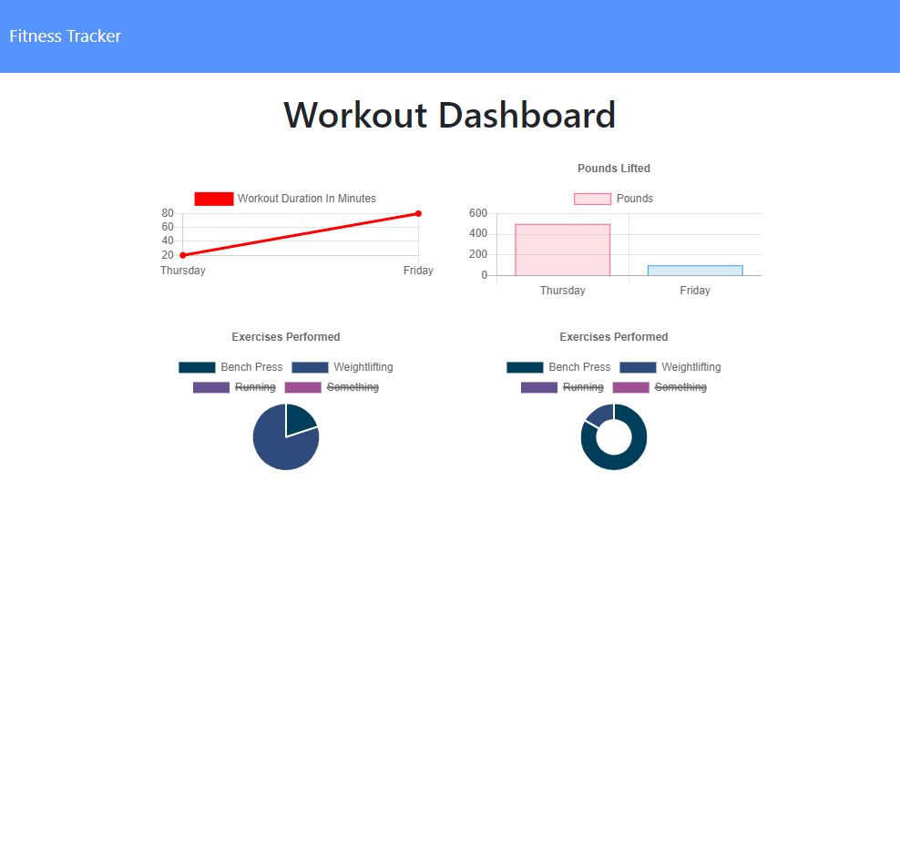
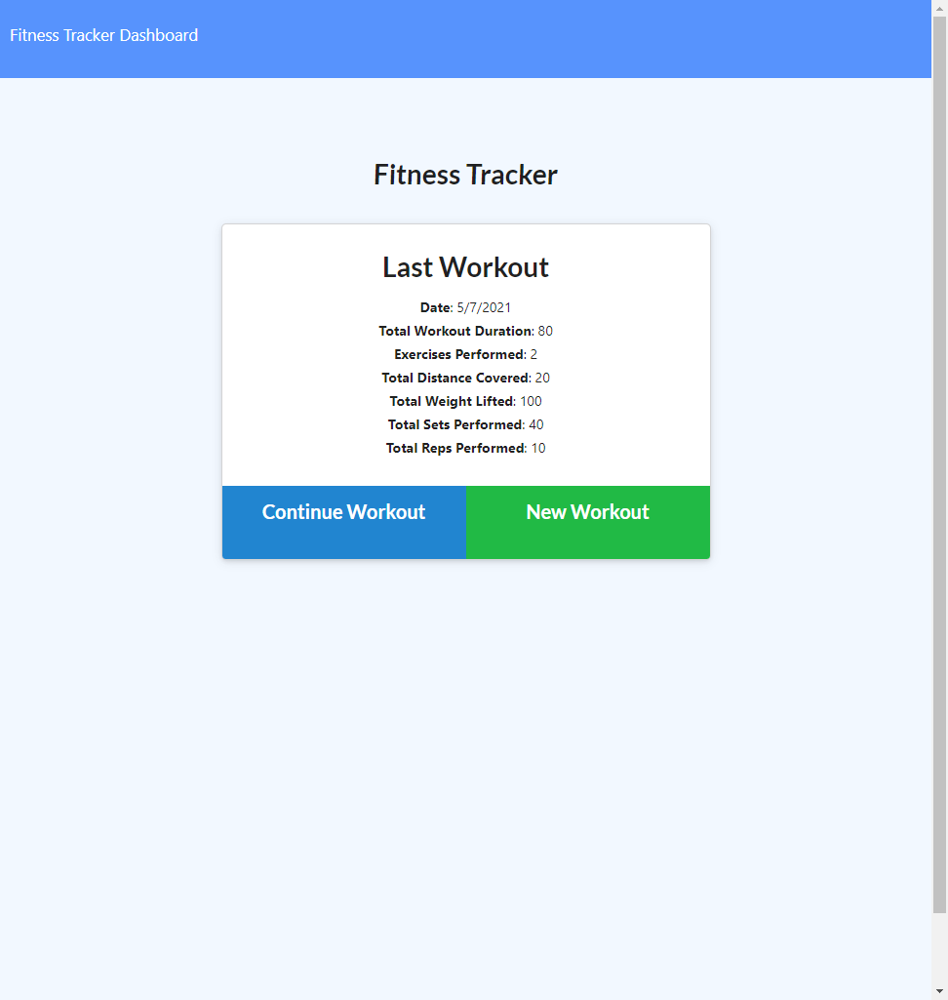

# Fitness-Tracker

## 

## Table of Contents

- [Description](#Description)
- [Installation Instructions](#Installation-Instructions)
- [Usage Information](#Usage-Information)
- [Contribution Guidelines](#Contribution-Guidelines)
- [Test Instructions](#Test-Instructions)
- [GitHub Page](#GitHub-Page)
- [Questions](#Questions)

## Description

This is fitness tracker, an app for users to log their workout and exercise records to tally their progress. Users can also view their progress in the past week in dynamic charts.

This app is deployed on Heroku and is available at the following link:

https://floating-retreat-42836.herokuapp.com/

## Installation Instructions

```
N/A
```

## Usage Information

Upon reaching the homepage, the user will be shown a form asking to either continue with last workout or to start a new one. According to the users, they can either add a new exercise to the last workout, or they can choose to start a brand new workout session.

When recording the exercise, the user can choose among cardio and resistence as the exercise category. The user needs to provide the name of the exercise as well as its duration for both types. For cardio, the user will also need to provide the distance covered. For resistence, the user needs to provide additional information on weight, sets, and reps. After successfully adding a new exercise, the total duration and weight will be tallied in a concise form back in the front page.

When visiting the user dashboard, the user can see charted data for the past week both for the workout duration as well as the lifted weight. Dynamic pie charts will be present to show the proportion of each activity.

## Sample Pages

### Dashboard



### Workout Summary



## Contribution Guidelines

```
N/A
```

## Test Instructions

```
N/A
```

## GitHub Page

https://github.com/runescape11111/Fitness-Tracker

## Questions

GitHub profile: github.com/runescape11111/

Email: olivershih@gmail.com
